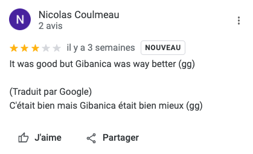

# A table

## Consigne

Un cousin à moi à mangé dans un restaurant dans la capitale du pays du challenge "Panneau" le 18/11/2022 non loin de bêtes peu communes.

Vous pouvez me dire ce qu'il a préféré ?

## Résolution

Pour ce challenge, il fallait avoir trouvé la réponse pour le challenge Panneau.

Je pars donc du principe que ce challenge était validé, et que l'on sait que le pays en question est la Serbie.

La capitale de la Serbie est Belgrade, il fallait également comprendre que "non loin de bêtes peu communes" faisait référence à un zoo.

En l'occurence il s'agissait de ce [zoo](https://www.google.com/maps/place/Zoo+de+Belgrade/@44.8249273,20.4547166,18.53z/data=!4m5!3m4!1s0x0:0x5e309d5a57114a1a!8m2!3d44.8249884!4d20.4542054).

De plus la date du 18/11/2022 était environ 3 semaines avant la date de la Cybernight, il fallait donc regarder dans les restaurants proches de ce zoo.

Le restaurant en question se nommait : Kalemegdanska terasa, il fallait trier les commentaires par "les plus récents" et chercher un commentaire en Français datant d'il y a environ 3 semaines.

