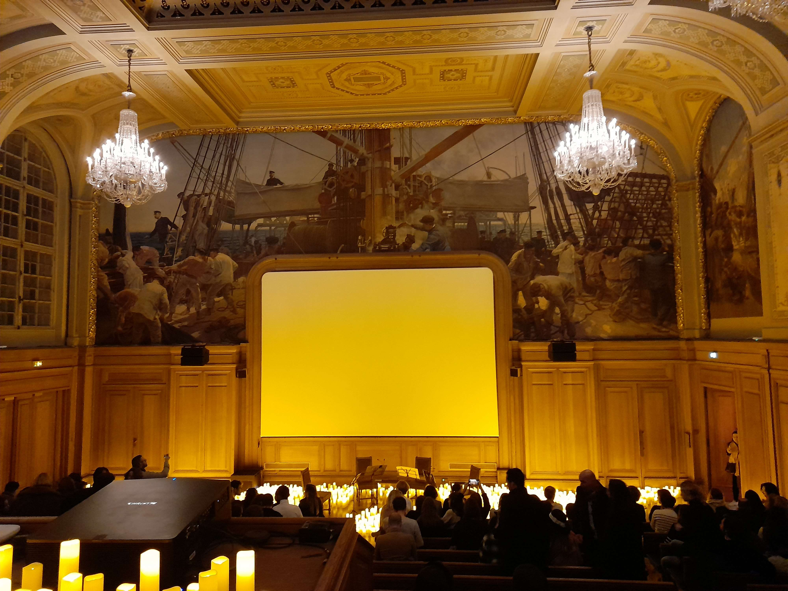

# Concerto

## Consignes

Je te laisse, le concert va bientôt commencer ! J'espère que quelqu'un l'enregistre.

Mais d'ailleurs, ou a eu lieu ce concert ? Quel est le nom de cet évenement ? Et à quel groupe / artiste ce concert rend hommage ?

Il faut donner le flag au format : CYBN{LIEU_EVENEMENT_GROUPE} (Pas d'accents, lettres, espaces)

Si par exemple le lieu est "Musée d'Orsay", l'évenement est "cybernight" et le groupe / artiste est "Izambert Clara ", alors le flag sera : CYBN{MUSEEDORSAY_CYBERNIGHT_IZAMBERTCLARA}

## Résolution

En effectuant une recherche inversée de l'image et en ne sélectionnat que du haut de l'écran jusqu'en bas de l'image, on tombe sur cet [article](https://www.hec.edu/fr/news-room/soiree-historique-de-la-fondation-hec) de HEC.

Dans l'article on apprend que l'endroit se nomme "la Maison de l'océan" aussi appelé "Institut océanique de Paris". En cherchant les événements qui s'y déroulent, on tombe sur les candlelight et en particulier le premier résultat en cherchant "la maison de l'ocean evenements" est : "candlelight : hommage à queen, institut océanographique de paris, 21 décembre".

On a donc trouvé le lieu, l'événement et l'hommage.
