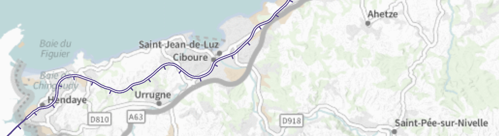
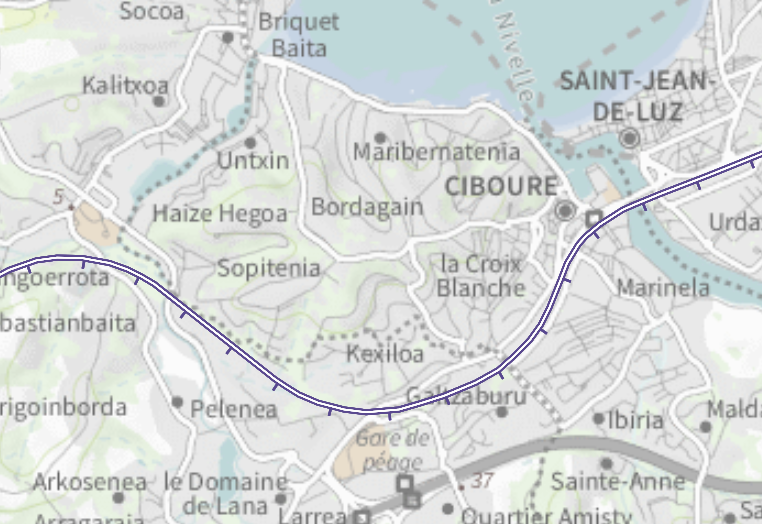

# J'aime les trains

## Consigne

Un TGV est parti aujourd'hui. De quelque part. Vous voulez bien me dire d'où, et le numero du TGV ?

le flag est au format CYBN{ville-de-depart_numero-TGV}

## Résolution

Dans le fichier transmission-record.txt on peut voir 3 villes dont une seule non censuré : Les redoutes.

En l'occurence Les Redoutes est un chemin de randonnée situé dans le sud de la France à la limite de la frontière Espagnole.

Après avoir essayé de simuler un compas avec l'outil de mesure de google maps, je suis parti sur une technique plus fructueuse.

Je suis allé chercher une [carte interactive des lignes de trains](https://www.sncf-reseau.com/fr/carte/carte-interactive-reseau-ferre-francais-0).

En concentrant ma recherche sur le Sud de la France coté Atlantique j'ai cherché les grandres lignes de TGV (ainsi que les gares TGV).

Après avoir repréré quelques gares proches de Les Redoutes, j'ai décidé de suivre les rails afin de trouver les deux autres noms de ville censurés.

J'ai trouvé un résultat sur et un probable (même si les distances ne coincidaient pas vraiment avec les donnés du fichier) :
 - Kexiloa (proche de Ciboure)
 - Saint-Jean-de-luz

En regardant les deux points temporels, on peut voir que le train se rapproche de Saint-Jean-de-luz sans SEMBLER s'éloigner de Keiloa, on peut donc en 
déduire que le train se trouve sur la courbe autour de kexiloa et que donc il a parcouru 2km entre les 2 transmissions, 1km vers kexiloa et 1km en 
s'éloignant de kexiloa.

On peut donc en déduire que le train voyage vers le nord. La seule gare au Sud de ces deux villes est Hendaye, on peut donc légitimement penser que le 
départ était de Hendaye. En regardant les trains au départ de Hendaye, on voit des TGV dont un partant à 7h12 numéro 8530.

On obtient donc le flag CYBN{hendaye_8530}

PS : Je ne sais pas à quoi correspondent les numéros cachés entre les noms de ville et la distance j'updaterai ce message si je trouve la réponse
