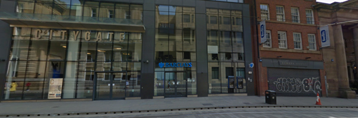

# La Banque

## Consigne

Je prévois un casse, mais mes coéquipiers ne m'ont pas dit ou était le rendez-vous, pourriez vous me dire dans quelle ville ça se situe ?

## Résolution

Dans cette image on peut voir deux choses principales :
 - City Gate
 - Berklays

En cherchant Berklays citygate sur google image, on tombe su une  qui montre des batiments forts ressemblants à l'image ci-dessus.

Cette image redirige vers 

On en déduis donc que la ville recherchée est Manchester
