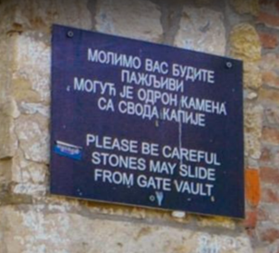

# Panneau

## Consigne

Dans quel pays se trouve cette pancarte ?

## Résolution

On peut lire sur cette pancarte "Please be careful rocks may slide from gate vault".

En cherchant cette phrase sur google et en regardant les images, on tombe sur cette [image](https://www.google.com/search?q=Please+be+careful+rocks+may+slide+from+gate+vault&rlz=1C5CHFA_enFR932FR932&hl=fr&sxsrf=ALiCzsZn0mcOnIOKuQxkMYMR4uBYHXKwxA:1670750231535&source=lnms&tbm=isch&sa=X&ved=2ahUKEwiRjrzQnfH7AhVHTaQEHd88ArgQ_AUoAnoECCoQBA&biw=3491&bih=1811&dpr=1.1#imgrc=QKFHlstvKsDnmM).

On y voit en arrière plan, le panneau. Cette image est nommée Belgrade fortress cannon. Belgrade se trouvant en Serbie, on trouve le pays en question.
