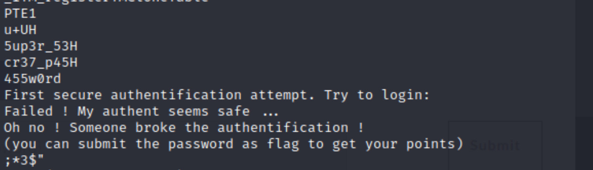

# Auth1

## Consigne

Faire une authentification sécurisée ça doit pas être si difficile que ça, si ?

Le flag n'est pas au format cybn{}

## Résolution

En utilisant la commande suivante, on peut voir les chaines de caractères écrites en dure dans le code :

```
strings auth1
```

En regardant dans le résultat de cette commande, on trouve ceci.



Cela ressemble beaucoup a "super secret password"

on peut voir ensuite la phrase "(you can submit the password as flag to get your points)".

On peut donc en conclure que (en nettoyant un peu les caractères superflus) ceci est le mot de passe, et donc le flag que l'on cherche.
