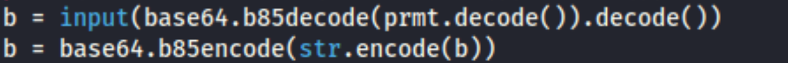

# Auth2

## Consigne

Bon en vrai au début j'étais naze, je retente !
Le flag n'est pas au format cybn{}

## Résolution

On peux voir dans auth2.py un if comparant a et b qui lorsque a et b sont égaux nous dit d'entrer ca comme flag.

En regardant plus haut on peut voir que b est un input qui ensuite et encodé en base 85

On en déduit que a est une chaine de caractère encodé en base 85, en la placant dans cet [outil](https://www.dcode.fr/code-ascii-85) avec la variante ipv6 on obtient le flag que l'on peut tester avec le code fourni.

