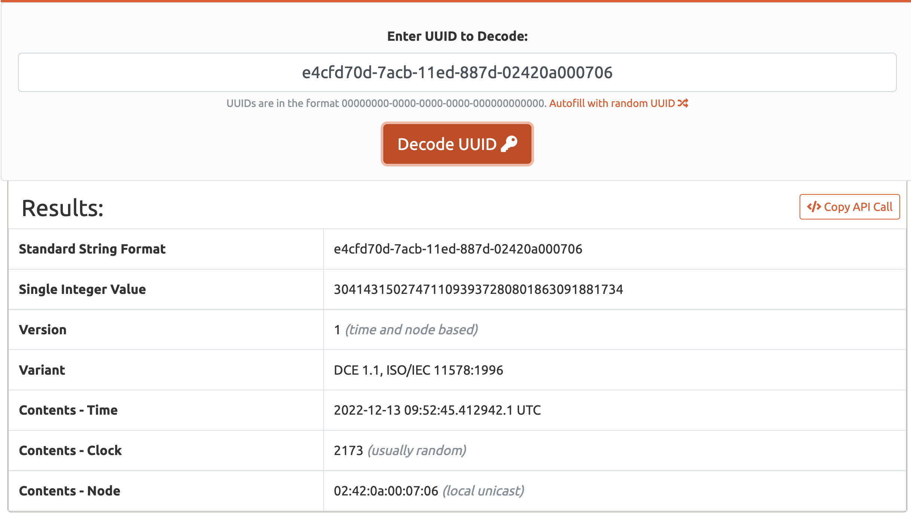

# Roombaverse - Ah bah c'est du propre

## Consigne

Volez le compte Admin.

## Résolution

Pour voler le compte admin, on peut utiliser plusieurs chemins, voler un cookie avec une faile XSS, utiliser une injection SQL pour récupérer un mot de passe ou bypass la connection.

En l'occurence aucune de ces deux options ne permettait de résoudre ce challenge.

Il faut donc creuser un peu plus sur la méthode d'authentification, ici cette méthode utilise un cookie auth avec comme valeur un uuid. 


Voici le mien : 

```e4cfd70d-7acb-11ed-887d-02420a000706```

En utilisant [cet outil]() pour décoder cet uuid, on obtient plusiseurs informations :



Une chose importante à noter est que cet uuid est de la version 1. En cherchant la méthode de génération des uuid v1 on remarque qu'ils sont générés en fonction de la date et des données suivantes :


Donc comme on peut le voir sur le screenshot précédent on peut récupérer de cet uuid la date de création de mon compte : le 13 Décembre 2022.

Si on pouvait récupérer la date de création du compte de l'Admin on pourrait recréer son cookie auth et donc se connecter.

En se baladant dans la section communauté du site que voit-on ?


Génial, on a la date de création de son compte avec heures, minutes et secondes. Cependant il reste un problème, les uuid v1 sont précis à la miliseconde près.

En explorant un peut plus le code source de la page on peut retrouver quelque chose de très intéresant. L'uuidtime de la date de cration du compte admin.


Ensuite il faut pouvoir déterminer les autres variables pour la création de l'uuid. La quatrième partie de l'uuid (clock sequence and variant) et node 
sont visibles avec le décoder il faut donc simplement vérifier qu'ils soient constants.

En créant un deuxieme compte sur une autre machine, on peut observer que effectivement ces parties sont invariantes.

Il suffit donc de se concentrer sur la partie créée en fonction du temps.

Pour cela il faut reprendre la manière de créer un uuid.

Note : NE PAS UTILISER LES LIBRAIRIES JAVASCRIPT, je dis pas ca car j'ai perdu 2h a cause de ca, noooon pas du tout.

Je (enfin MrSheepSheep) conseille l'utilisation de python et du module uuid. Dans ce module on a une fonction pour généerer un uuid v1. Cependant 
cette fonction ne peut générer un uuid v1 en fonction d'un time uuid, il faut donc reprendre les étapes de création et de remplacer cela avec nos donnés.

Il est possible si vous le souhaitez de le refaire vous même à partir du code source disponible [ici](https://github.com/python/cpython/blob/3.11/Lib/uuid.py)

Ou vous pouvez récupérer le fichier [script.py](script.py) que j'ai créé pour finir ce challenge.

Ce script vous donnera l'uuid suivant : 


Il vous suffit alors de vous connecter a votre compte et d'intercepter la requete de la page /compte (avec burp par exemple)


et de remplacer votre cookie auth par celui de l'admin récupéré via le script.


Il suffit ensuite de regarder la réponse et on peut voir dans le code de la page mon compte de l'admin le flag.


