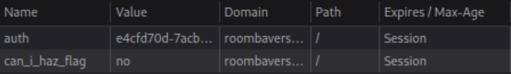
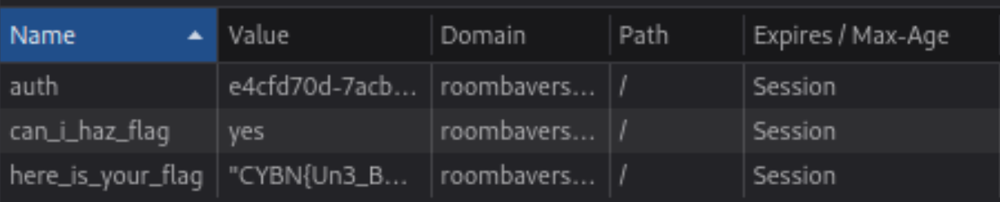

# Roombaverse - Cooking Roomba

## Consigne

Aucune information.

## Résolution

Dans le titre on peut lire cooking, cela fait penser à cookie, et en inspectant les cookies qu voit-on ?

En changeant la valeur du cookie can_i_haz_flag, puis en se reconnectant on obtient le cookie suivant (et le flag)

